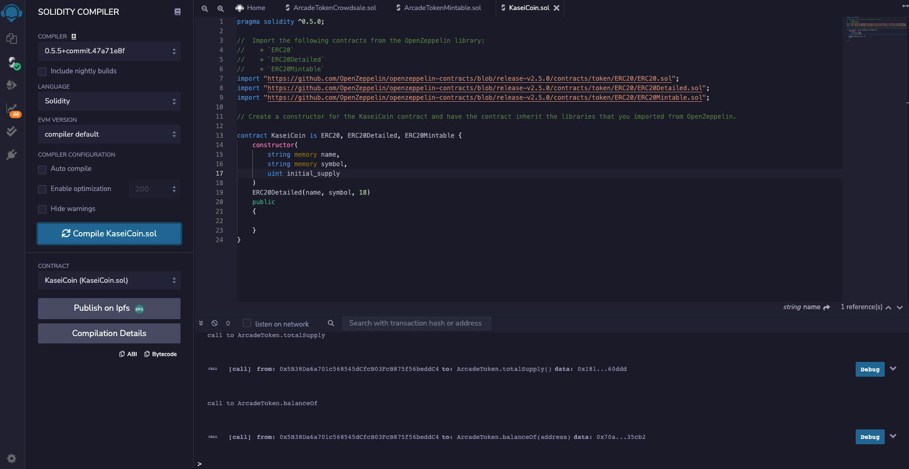
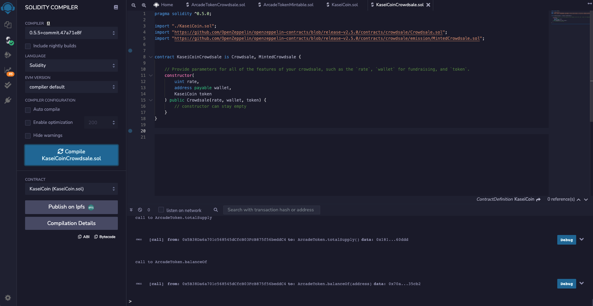
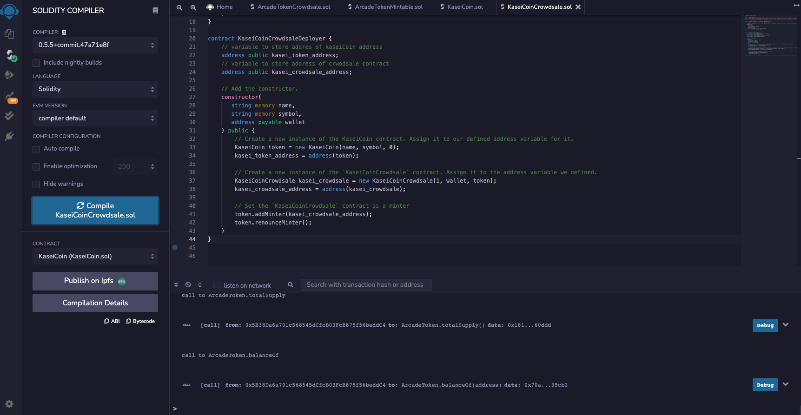

# UWFintech_Challenge_21

## Description

We are creating a fungible token called KasaiCoin(KAI) that is ERC-20 compliant and that will be minted by using a `Crowdsale` contract from the OpenZeppelin Solidity library. This crowdsale contract will manage the entire crowdsale process, allowing users to send ether to the contract and in return recaive KAI or Kasei tokens. The contract mints tokens automatically and distributes them to the buyer, all in one transaction.

## Technologies
**Solidity 0.5.0**  
**Remix - Ethereum IDE**  
**OpenZeppelin Contract Libraries**  
**Ganache** - Blockchain Test Network  
**MetaMark** - Ethereum/ERC20 Token Wallet  

## Installation Guide
Add the code, compile the code, and deploy the contract using the Remix IDE. The Remix IDE is a browser based IDE - the link is below.  

[REMIX IDE](https://remix.ethereum.org/)  

## Evaluation Evidence
1. Compiled KasaiCoin Contract

2. Compiled KasaiCoinCrowdsale Contract

3. Compiled KasaiCoinDeployer Contract

4. Deployed contract functionality
[HERE](https://www.loom.com/share/81f6c9fa15e14e5b99fa6fcaea9ed59c) is a short video showing the crowdsale deployment, purchasing tokens, and verifying the transactions within Ganache & Metamask.

## Contributors
Jacob Vissering  
jake.vissering@gmail.com  
[LinkedIn](https://www.linkedin.com/in/jacobvissering/)
## License
MIT License